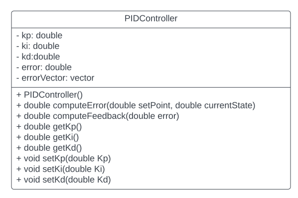

# TestDrivenDev-PIDcontrol-Pair1

 [](https://codecov.io/gh/saiteja12-g/TestDrivenDev-PIDcontrol-Pair1)

## Authors of Pair 1:
 ### [Sai Teja Gilukara](https://github.com/saiteja12-g) (saitejag@umd.edu) - Driver 
 ### [Aaqib Barodawala](https://github.com/aaqibsb) (abarodaw@umd.edu) - Navigator

## Authors of Pair 2: 
### [Darshit Desai](https://www.github.com/darshit-desai) (darshit@umd.edu) - Driver
### [Sameer Arjun S](https://github.com/Sameer-Arjun-S) (ssarjun@umd.edu) - Navigator

## Overview
A PID contol program for Acme Robotics using test driven development

## UML Diagram



## Instructions to run the program locally

## Standard install and build via command-line
```
git clone --recursive https://github.com/saiteja12-g/TestDrivenDev-PIDcontrol-Pair1.git
cd TestDrivenDev-PIDcontrol-Pair1
cmake -S ./ -B build/
cmake --build build/
./build/app/shell-app
```

## Run tests
```
ctest --test-dir build/
```

## Create Doxygen docs
```
cmake --build build/ --target docs
```